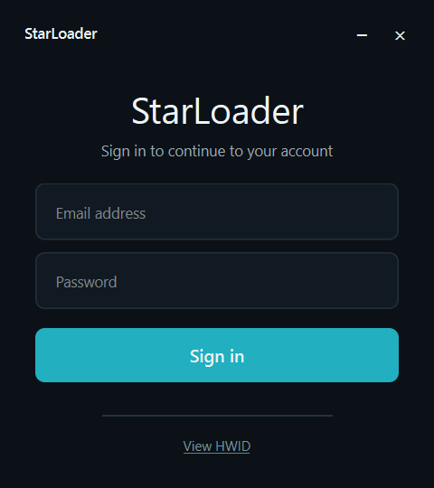
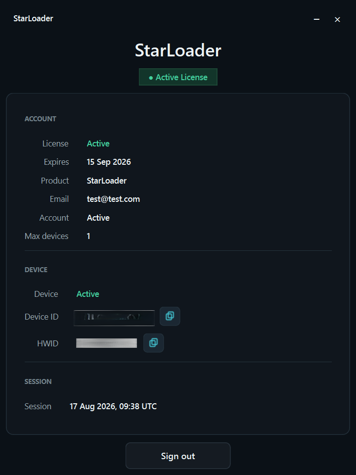
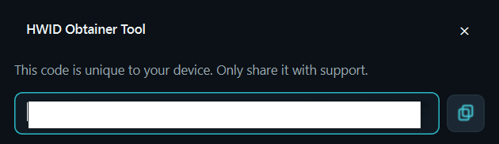

# StarLoader Secure Login and Hardware-Bound Licensing

StarLoader is a Windows-first reference implementation for account login, license activation, and TPM-backed device verification. It contains two Qt desktop applications, a Go API, and a PostgreSQL persistence layer.

The system is designed around one principle: a reusable password or copied HWID string is not sufficient proof that the request came from the previously activated computer. A device must also prove possession of a non-exportable TPM P-256 private key by signing a short-lived, single-use server challenge.

All identifiers generated by StarLoader are canonical lowercase UUIDv7 values. This includes database primary keys, authentication sessions, device challenges, server request IDs, and client request IDs. Database constraints reject non-v7 IDs for persisted entities.

## Screenshots

All three screens share one design language: a cold slate-black background (`#0B1117`), a single teal accent (`#22AFC0`), custom frameless window chrome, and icon-free controls. The palette and layout are embedded in each form, so the appearance does not depend on the theme file being loaded.

<div align="center">



**Login form** — email and password, one primary action, and an in-line View HWID link.



**Authenticated dashboard** — license status badge, grouped Account / Device / Session rows, status-colored values, and copy buttons for the device ID and HWID.



**HWID dialog** — the local device fingerprint with a one-click copy button; nothing is sent to the API.

</div>

## What is included

| Component | Technology | Responsibility |
|---|---|---|
| `LicenseClient` | Qt 6 / C++ | Collects identity signals, performs login, signs the challenge through Windows TPM/CNG, verifies the Ed25519 session token, loads the authenticated profile, and holds the token in memory while displaying the dashboard. |
| `HwidObtainer` | Qt 6 / C++ | Displays normalized hardware diagnostics and locally tests valid, modified-challenge, and modified-signature behavior. It does not send data to the API. |
| `backend` | Go 1.24 | Authenticates accounts/licenses, issues and consumes challenges transactionally, evaluates device similarity, enforces activation limits, and signs one-hour session tokens. |
| PostgreSQL | PostgreSQL 17 | Stores users, HMAC-protected licenses and hardware signals, devices, sessions, and challenges. |

## Comparison with common licensing approaches

| Approach | Copy resistance | Hardware privacy | Reset tolerance | Server control | Main weakness |
|---|---:|---:|---:|---:|---|
| MAC address or volume serial only | Low | Low | Low | Optional | Values are easy to spoof, change, or copy. |
| A single concatenated HWID string | Low–medium | Often low | Low | Optional | One hardware replacement can lock out a valid user; copied identifiers are replayable. |
| Raw serial numbers stored by the server | Medium | Poor | Depends on policy | Good | A database breach exposes stable, sensitive machine identifiers. |
| Password plus bearer token only | Low for device binding | Good | High | Good | Stolen credentials/token can be used from another machine. |
| Exportable software private key | Medium | Good | High | Good | Malware or a copied profile can export and clone the key. |
| StarLoader TPM proof plus weighted signals | High | Good | Configurable | Good | Requires TPM 2.0 and careful recovery/reset operations. |

StarLoader does not treat a hardware fingerprint as a secret or as cryptographic proof. The fingerprint helps identify a device; the TPM signature proves possession of the device key. On the server, serial-like values are individually protected with HMAC and are never stored in plaintext.

## Comparison with market applications

The table above compares *approaches*; this section compares StarLoader with the real products users are likely to know. Its closest commercial analogues are account-based subscription managers (Adobe Creative Cloud, JetBrains), game and DRM activation (Steam, Denuvo), hardware-bound protection (Sentinel HASP dongles, VMProtect-style HWID keys), and security products that bind accounts to authenticators (1Password passkeys).

| Product | Activation model | Hardware binding | Offline tolerance | Main weakness |
|---|---|---|---|---|
| **Steam** | Account login + Steam Guard (email/mobile 2FA) | None — device "trust" is a stored cookie | High | A stolen session or credential works from any machine; device trust is not proof of possession. |
| **Adobe Creative Cloud** | Account sign-in; two activated devices, one active session | None | Low–medium; offline deactivation | The machine limit is pure account state; credentials can be shared and activations race with deactivation. |
| **Microsoft 365 / Windows digital license** | Account plus installation/device limits | Partial — device hash used for Windows reactivation | Medium; offline grace | No cryptographic device proof; account takeover grants full access. |
| **JetBrains** | Account subscription, License Vault (floating), offline activation codes | None | High; offline codes and fallback licenses | Offline activation codes are bearer values that can be shared or replayed. |
| **Sentinel HASP / USB dongles** | Physical dongle checked at runtime | Strong — hardware token | High | Dongle loss/theft, shipping logistics, drivers; software emulators exist. |
| **VMProtect-style HWID keygens** | Offline fingerprint + serial check | Weak–medium — hash of readable hardware strings | High | The fingerprint is a replayable string, not cryptographic proof; any hardware change can lock out a valid user. |
| **1Password** | Account + platform authenticators (Windows Hello / TPM-backed passkeys) | Strong where passkeys are enrolled | Medium | Binding depends on user enrollment; recovery codes remain bearer secrets. |
| **Figma / Linear / Notion (pure SaaS)** | Session/SSO login | None | None | Credential theft works from any device; device management is optional or absent. |
| **StarLoader** | License + TPM P-256 challenge proof + weighted signals | Strong — non-exportable TPM key, HMAC-protected signals | None by design — every activation is online | Requires TPM 2.0; recovery must be an audited support process. |

There is a consistent pattern behind these rows. Most commercial products bind to **account state** rather than to hardware: whoever holds the credentials or an offline code can activate from anywhere, and the only protection is a device counter the server maintains. Classic keygen-style protection binds to hardware but only by **hashing readable strings** — values that can be copied, spoofed, or invalidated by a single hardware change. Hardware dongles are the only widely deployed approach with real possession proof, and they pay for it with logistics.

StarLoader takes the dongle idea and makes it software-defined. Instead of carrying a token, the machine proves possession of a non-exportable TPM P-256 private key by signing a fresh, single-use server challenge, and weighted hardware signals decide whether a slightly changed machine is still "the same device". The server keeps full control — license status, revocation, device limits, one-hour tokens — which is the strength of the account model, while the TPM proof closes the hole that model usually has: a stolen credential no longer works from another machine.

In practice, compared with the products above:

- Unlike Steam or Adobe, a leaked password or session token cannot be used from a different computer; the challenge signature is required on top of the credential.
- Unlike VMProtect-style HWIDs, the fingerprint alone is useless — the server's similarity scoring only matters if the machine can also sign the challenge with the registered TPM key.
- Unlike dongles, there is nothing to carry, lose, or ship; revocation and device limits are enforced server-side in real time.
- Unlike pure SaaS, every activation is bound to a physical machine, so a license cannot be quietly shared across the internet.
- The trade-off, shared with dongles and passkeys, is recovery: TPM clears and hardware replacements need an audited reset path instead of a support agent simply re-issuing a code.

## Authentication flow

1. The client ensures that the persistent TPM P-256 identity key exists.
2. It collects normalized hardware signals and calculates the final fingerprint.
3. `POST /v1/auth/login` verifies the account password and HMAC-protected license.
4. The server atomically creates a UUIDv7 pending session and a random 32-byte challenge. Only the challenge SHA-256 digest is stored.
5. The client signs the decoded challenge with the TPM key and sends the exact challenge, raw CNG `r || s` signature, CNG public-key blob, and hardware signals to `POST /v1/device/verify`.
6. Inside one PostgreSQL transaction, the server locks the challenge, session, license, and relevant device rows. It validates expiry, proof, revocation, similarity, and activation limits before consuming the challenge.
7. The server creates or refreshes the device and returns a compact Ed25519-signed token with an exact one-hour lifetime.
8. The client verifies the embedded trust key, JWS header, signature, issuer, audience, product, device, license, features, `iat`, and `exp`, then retains the token only in memory.
9. The client sends that token as its sole `Authorization: Bearer ...` credential to `GET /v1/me`. The API derives the user, license, and device identity only from verified claims and reloads their current database state.
10. The dashboard is shown only after `/v1/me` returns the safe authenticated profile. Signing out destroys the in-memory session/profile state and returns to an empty login form.
11. Replaying the same challenge returns `CHALLENGE_CONSUMED` and cannot create another device.

## Device matching policy

An existing device is accepted at a score of 70 or higher:

| Signal | Weight |
|---|---:|
| TPM public key | 50 |
| SMBIOS system UUID | 20 |
| Motherboard serial | 15 |
| BIOS serial | 5 |
| System disk serial | 5 |
| Machine GUID | 5 |

This is intentionally different from exact-string HWID matching. For example, a system disk replacement does not invalidate an otherwise identical TPM-bound computer. A revoked TPM key is always denied; scoring cannot override revocation. Missing signals contribute zero points and never become wildcard matches.

## Security properties and boundaries

- Passwords use bounded Argon2id parameters.
- License keys and hardware signals use separate HMAC secrets.
- Raw license keys, raw challenge bytes, passwords, and raw serial values are not persisted or logged.
- Challenges are short-lived, single-use, and consumed only after the verification transaction succeeds.
- Session tokens use Ed25519 and expire exactly 3,600 seconds after `iat`.
- Session tokens are retained only in process memory, are never persisted by the client, and are cleared on profile failure or sign-out.
- The Qt client verifies the server public key embedded at build time; a runtime environment variable cannot replace the trust root.
- HTTP is rejected by the client except for an explicit loopback-only development switch.
- Rate limits apply per client IP for login and per session for device verification.
- UUIDv7 improves index locality and operational tracing, but UUIDs are identifiers—not authorization secrets.

This project does not provide certificate pinning, refresh tokens, offline grace periods, an admin web panel, automatic account recovery, or remote TPM attestation. TPM possession proves access to the local key, not that the operating system is malware-free.

## Repository layout

```text
backend/          Go service, migrations, domain/security/service/store packages
deploy/           Local PostgreSQL Compose file
docs/             Original requirements, design, and implementation plan
hwid-obtainer/    Standalone local diagnostic application
license-client/   Login client, API integration, auth state machine, token verifier
scripts/          Complete verification entry point
server-contract/  Versioned HTTP contract
shared/           Hardware collection, normalization, fingerprint, and TPM code
```

## Prerequisites

- Windows 10 or Windows 11 with TPM 2.0 enabled
- Docker Desktop
- Qt 6.11.1 MinGW, CMake, Ninja, and MinGW under `C:\Qt`
- OpenSSL Crypto for the Qt/MinGW toolchain; the tested installation is `C:\Qt\Tools\mingw1310_64\opt`
- Optional local Go 1.24 installation; all documented Go commands can run in Docker

The current workspace was verified with Qt 6.11.1, MinGW 13.1, OpenSSL 1.1.1k, Go 1.24 containers, and PostgreSQL 17.

## Configuration

Copy `.env.example` to `.env` and replace every `replace-with-...` placeholder. Use independent random values for `LICENSE_HMAC_KEY`, `HARDWARE_HMAC_KEY`, and the PostgreSQL password. The two HMAC keys must differ.

Important variables:

| Variable | Used by | Purpose |
|---|---|---|
| `DATABASE_URL` | Backend/admin/migration | PostgreSQL connection string. |
| `LICENSE_HMAC_KEY` | Backend/admin | Protects normalized license keys. |
| `HARDWARE_HMAC_KEY` | Backend | Protects individual hardware signals. |
| `ED25519_PRIVATE_KEY` | Backend | Standard Base64 32-byte seed or 64-byte private key. |
| `LICENSE_ISSUER` | Backend/client policy | Required token issuer. |
| `LICENSE_AUDIENCE` | Backend/client policy | Required token audience. |
| `PRODUCT` | Backend/client policy | Product binding for licenses and tokens. |
| `SERVER_ADDR` | Backend | Listen address, default `:8080`. |
| `LOGIN_TIMEOUT` | Backend | Positive Go duration, default `10s`. |
| `TRUSTED_PROXIES` | Backend | Optional comma-separated CIDR list. Only add proxies you control. |
| `POSTGRES_PORT` | Compose | Optional host port, default `5432`. |

Do not commit `.env`. Do not reuse sample or test secrets in production.

## Quick start

### 1. Start PostgreSQL

```powershell
Copy-Item .env.example .env
# Edit .env before continuing.
docker compose --env-file .env -f deploy/compose.yaml up -d postgres
```

If host port 5432 is occupied, set `POSTGRES_PORT=55432` in `.env` and use the same port in `DATABASE_URL`.

### 2. Generate the signing key pair

```powershell
docker run --rm -v "${PWD}:/workspace" -w /workspace/backend golang:1.24 go run ./cmd/server keygen
```

The command prints two lines:

- Put `ED25519_PRIVATE_KEY` only in the repository-root `.env` file used by the documented `--env-file .env` commands, or in a production secret manager. Do not create a separate `backend/.env` for this quick-start path.
- Pass `STARLOADER_ED25519_PUBLIC_KEY` to CMake when building the trusted client.

Never distribute the private key with the desktop applications. Rotating this key requires rebuilding/redeploying clients or implementing an explicit multi-key rotation policy.

### 3. Apply the migration

When Go runs inside Docker, `DATABASE_URL` must use `host.docker.internal` rather than `localhost`:

```powershell
docker run --rm --add-host host.docker.internal:host-gateway --env-file .env -v "${PWD}:/workspace" -w /workspace/backend golang:1.24 go run ./cmd/server migrate up
```

`migrate down` drops the StarLoader schema objects and destroys application data. Use it only for disposable development/test databases or after a verified backup.

Applied versions are recorded in `schema_migrations`. `migrate up` takes a PostgreSQL advisory transaction lock, applies only pending versions, and is safe to run repeatedly or from concurrent deployment jobs.

### 4. Create a user

Interactive mode hides the password:

```powershell
docker run --rm -it --add-host host.docker.internal:host-gateway --env-file .env -v "${PWD}:/workspace" -w /workspace/backend golang:1.24 go run ./cmd/server admin create-user --email user@example.com
```

For automation, supply password and confirmation as two standard-input lines. Do not place the password in command-line arguments:

```powershell
"password`npassword" | docker run --rm -i --add-host host.docker.internal:host-gateway --env-file .env -v "${PWD}:/workspace" -w /workspace/backend golang:1.24 go run ./cmd/server admin create-user --email user@example.com --password-stdin
```

### 5. Create a license

```powershell
docker run --rm --add-host host.docker.internal:host-gateway --env-file .env -v "${PWD}:/workspace" -w /workspace/backend golang:1.24 go run ./cmd/server admin create-license --user user@example.com --product StarLoader --days 30 --max-devices 1
```

The plaintext license is printed once, only after persistence succeeds. Store or deliver it securely; the database cannot recover it later.

### 6. Start the API

```powershell
docker run --rm --name starloader-api --add-host host.docker.internal:host-gateway --env-file .env -e SERVER_ADDR=:8080 -p 127.0.0.1:8080:8080 -v "${PWD}:/workspace" -w /workspace/backend golang:1.24 go run ./cmd/server serve
```

Check readiness:

```powershell
Invoke-RestMethod http://127.0.0.1:8080/healthz
```

The backend serves plain HTTP itself. In production, expose it only behind a correctly configured HTTPS reverse proxy/load balancer. Keep the backend network private and set `TRUSTED_PROXIES` narrowly; otherwise forwarded client IP headers are ignored.

### 7. Configure and build both Qt applications

Replace `<PUBLIC_KEY>` with the generated public key:

```powershell
$env:Path = "C:\Qt\Tools\mingw1310_64\bin;C:\Qt\6.11.1\mingw_64\bin;C:\Qt\Tools\Ninja;C:\Qt\Tools\mingw1310_64\opt\bin;$env:Path"
& 'C:\Qt\Tools\CMake_64\bin\cmake.exe' -S . -B build -G Ninja `
  -DCMAKE_PREFIX_PATH=C:\Qt\6.11.1\mingw_64 `
  -DOPENSSL_ROOT_DIR=C:\Qt\Tools\mingw1310_64\opt `
  -DSTARLOADER_ED25519_PUBLIC_KEY=<PUBLIC_KEY> `
  -DSTARLOADER_API_URL=https://api.example.com
& 'C:\Qt\Tools\CMake_64\bin\cmake.exe' --build build
& 'C:\Qt\Tools\CMake_64\bin\ctest.exe' --test-dir build --output-on-failure
```

Expected executables:

- `build\license-client\LicenseClient.exe`
- `build\hwid-obtainer\HwidObtainer.exe`

### 8. Run a local login

Non-deployed MinGW builds need the Qt, MinGW, and OpenSSL runtime DLL directories on `PATH` in every PowerShell session used to start an executable. The assignment below affects only the current PowerShell process; it does not modify the machine-wide `PATH`:

```powershell
$env:Path = "C:\Qt\Tools\mingw1310_64\bin;C:\Qt\6.11.1\mingw_64\bin;C:\Qt\Tools\mingw1310_64\opt\bin;$env:Path"
$env:STARLOADER_API_URL = 'http://127.0.0.1:8080'
$env:STARLOADER_ALLOW_HTTP_LOCAL = '1'
& .\build\license-client\LicenseClient.exe
```

Keep PostgreSQL and the API from steps 1 and 6 running while logging in. Enter the account email and password created in step 4. A successful TPM/device verification is followed automatically by `GET /v1/me`; the login window is replaced only after that profile request succeeds.

Do not set `STARLOADER_ALLOW_HTTP_LOCAL` in production. A non-loopback HTTP URL remains blocked even if the variable is present. A packaged deployment should carry its runtime DLLs beside the executable (for example via Qt deployment tooling) instead of depending on a developer `PATH`.

## Authenticated dashboard and sign-out

The dashboard presents the safe profile fields inside a single card, grouped into **Account**, **Device**, and **Session** sections: license status and expiry, product, email, account status, maximum devices, device status, the shortened server device ID, session expiry, and the local masked display HWID. A status badge summarizes the license (`● Active License`, turning red for revoked/expired and amber for warning states), status-bearing values are colored (green for active, red for revoked/expired, amber for warnings), and the device ID and HWID rows each carry a one-click copy button. It never receives or displays the bearer token, password, license key, HMAC values, TPM keys/signatures, or raw hardware serials; the client keeps the token only in its in-memory authentication state.

Select **Sign out** to clear the in-memory token, profile, and authentication identifiers, close the dashboard, clear both credential inputs, and return to the login window. Closing the dashboard normally exits the application instead. The login window, HWID dialog, and dashboard all use the same custom dark title bar without a native icon slot.

To run the diagnostic application from a fresh PowerShell session, apply the same runtime `PATH` first:

```powershell
$env:Path = "C:\Qt\Tools\mingw1310_64\bin;C:\Qt\6.11.1\mingw_64\bin;C:\Qt\Tools\mingw1310_64\opt\bin;$env:Path"
& .\build\hwid-obtainer\HwidObtainer.exe
```

## Diagnostic application

Run `HwidObtainer.exe` before investigating backend problems. It shows each available/unavailable signal, a masked display identifier, TPM key status, and three local proof checks:

- original challenge: accepted;
- modified challenge: rejected;
- modified signature: rejected.

The tool does not grant a license and does not call the API. It separates local Windows/TPM issues from account, license, network, and server issues.

## Automated verification

Run the complete test entry point from PowerShell:

```powershell
.\scripts\test-all.ps1
```

The script creates an isolated PostgreSQL 17 container, then runs:

- all Go unit and real-PostgreSQL integration tests with the race detector;
- black-box health, login, P-256 challenge, device verification, Ed25519 token, claim-bound `/v1/me`, invalid/expired bearer rejection, exact safe profile fields, and replay checks;
- `go vet`;
- migration, admin user, admin license, and key-generation command checks;
- complete Qt configure/build and CTest;
- whitespace validation.

The temporary database container is removed in a `finally` block. Override its host port if necessary:

```powershell
.\scripts\test-all.ps1 -PostgresPort 55435 -ApiPort 58081
```

## API contract

The exact JSON fields, status behavior, cryptographic byte formats, response schema, and safe error codes are documented in [server-contract/API.md](server-contract/API.md).

`GET /v1/me` requires exactly one valid bearer session token. It accepts no request body or request-supplied identity, returns the current safe account/license/device projection, and rejects invalid or expired tokens with `401 INVALID_SESSION_TOKEN`. The endpoint checks current PostgreSQL status on every call, so a still-signed token does not bypass later account, license, or device restrictions.

The backend intentionally rejects unknown JSON fields, multiple JSON values, oversized bodies, unsupported content types, malformed canonical UUIDs, expired sessions/challenges/licenses, consumed challenges, invalid TPM proofs, revoked entities, and activation-limit violations.

## Production checklist

- Generate fresh independent secrets; never use repository/test values.
- Store the Ed25519 private key and HMAC keys in a secret manager.
- Build the client with the matching public key and archive the build provenance.
- Terminate TLS with modern settings and keep the Go listener private.
- Configure PostgreSQL backups, encryption, least-privilege credentials, and monitoring.
- Restrict `TRUSTED_PROXIES` to actual proxy CIDRs.
- Protect admin command access and capture the one-time license output securely.
- Monitor rate-limit responses, revocations, unusual activation patterns, and request UUIDv7 support codes.
- Test TPM replacement, motherboard service, disk replacement, license revocation, and database restore procedures before launch.

## Reset and recovery implications

Clearing the TPM, deleting the persistent CNG key, or reinstalling Windows in a way that removes it changes the cryptographic device identity. StarLoader may treat the computer as a new activation even if other serials match. Do not silently weaken the proof policy to work around this.

A safe support process should authenticate the account owner, revoke the old device record, document the reason, and then allow a new activation. Database deletion is not a substitute for an auditable recovery process.

## Troubleshooting

### The client reports TPM unavailable

Confirm TPM 2.0 is enabled in firmware and Windows Security, then run `HwidObtainer`. If key creation fails, inspect the local diagnostic error before testing the server.

### The client reports token verifier unavailable

Reconfigure/rebuild `LicenseClient` with the Base64 public key corresponding to the backend private key. The trust root is embedded at build time and cannot be repaired with a runtime environment variable.

### Local HTTP is rejected

Both conditions are required: `STARLOADER_API_URL` must be a loopback URL and `STARLOADER_ALLOW_HTTP_LOCAL` must equal `1`.

### The client reports a network error against a deployed server

The client resolves its API base URL in this order: the runtime `STARLOADER_API_URL` environment variable, then the `https://` URL baked at build time via `-DSTARLOADER_API_URL=...`. CMake warns (but does not fail) when the baked URL is still the placeholder `https://api.starloader.example`, and it refuses any non-`https://` value; use the `qt-mingw` preset or `-DSTARLOADER_API_URL=...` to bake the deployed endpoint. If neither source points at a reachable HTTPS endpoint, the login fails with `NETWORK_ERROR`.

Verify from the machine running the client that `https://<your-server>/healthz` returns `200` over a certificate the OS trusts. Plain HTTP is rejected for non-loopback hosts (`INSECURE_TRANSPORT`) and self-signed certificates fail the TLS handshake (`NETWORK_ERROR`). Since the server ships plain HTTP, terminate TLS at a reverse proxy in front of it and set `TRUSTED_PROXIES` to that proxy's CIDR.

Since the 2026-08-16 change, the failure dialog includes the underlying Qt network error (for example `host not found`, `connection refused`, or `SSL handshake failed`) instead of a generic message, which distinguishes DNS, firewall, and certificate problems.

### Database connection fails from Docker

Use `host.docker.internal` in `DATABASE_URL`. `localhost` inside the Go container refers to that container, not the Windows host.

### Port 5432 is already in use

Set `POSTGRES_PORT` to another loopback port and update `DATABASE_URL`. The verification script defaults to port 55434 and accepts an override.

### A valid machine reaches the device limit

Check whether its TPM key was cleared/recreated and whether an old device is still active. The score threshold tolerates limited hardware replacement, but a new TPM key is intentionally significant.

## License

No open-source license has been declared in this repository. Add an explicit license before redistributing the source or binaries.
